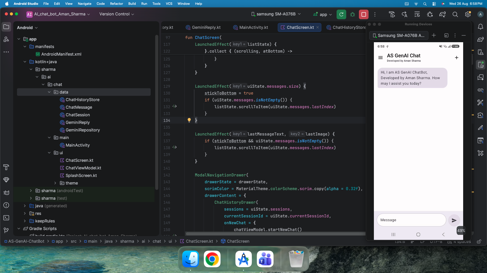
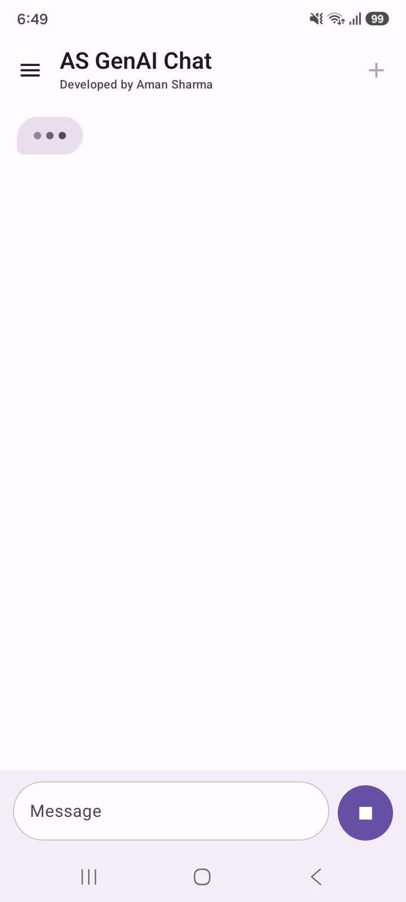
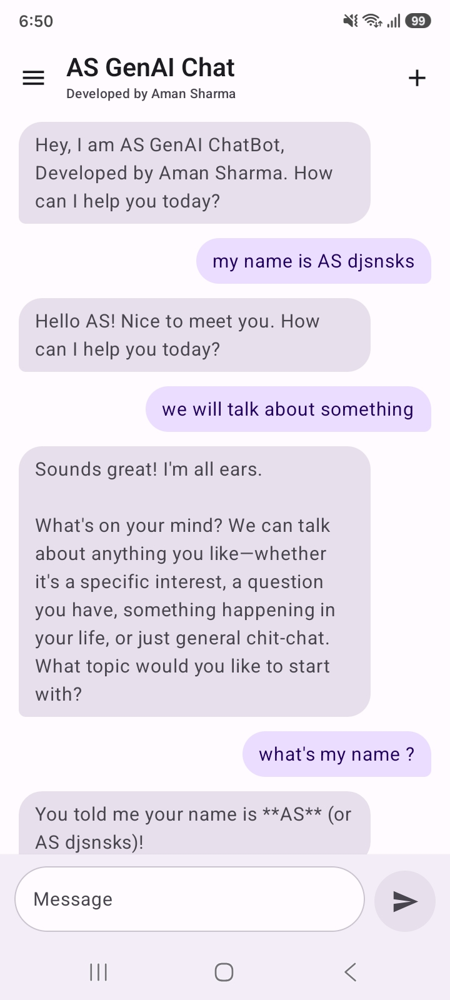
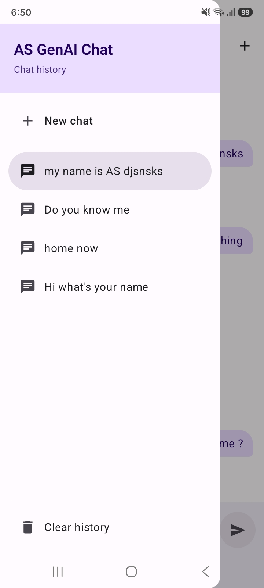

# AS GenAI Chat

A modern AI chatbot for Android built with Kotlin and Jetpack Compose, powered by Google's Gemini AI.

AS GenAI Chat provides a simple conversational interface with support for starting new chats, continuing conversations, and managing chat history.

  

## What I Built

- Integrated Google's Gemini AI for AI-powered conversations
- Built a complete chat interface using Jetpack Compose
- Added conversational messaging with user and AI responses
- Added new chat functionality
- Added chat history to access previous conversations
- Added clear history functionality
- Designed separate user and AI message layouts
- Added a navigation drawer for chat history and chat management
- Added a clean light theme with a simple Material 3-inspired interface
- Designed the UI to keep conversations readable and easy to use

## Technology

- Kotlin
- Jetpack Compose
- Material 3
- Gemini API
- Google AI Studio
- Android

## My Role

I designed and developed the application independently, including the Android UI, chat experience, navigation, chat history, and Gemini AI integration.

The focus was on creating a lightweight and practical AI chat experience while keeping the interface clean and responsive.

## Screenshots

  
  
  

  

## Project

This project demonstrates my experience with modern Android UI development, API integration, conversational interfaces, and building AI-powered mobile applications with Gemini.

## Developer

**Aman Sharma**

Android Developer | Kotlin | Jetpack Compose

[LinkedIn](https://www.linkedin.com/in/engineer-aman-sharma)